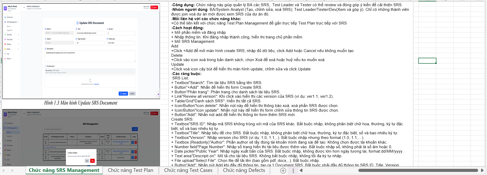
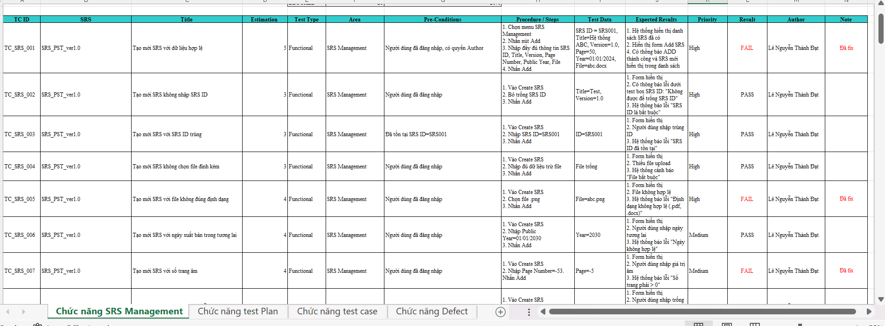
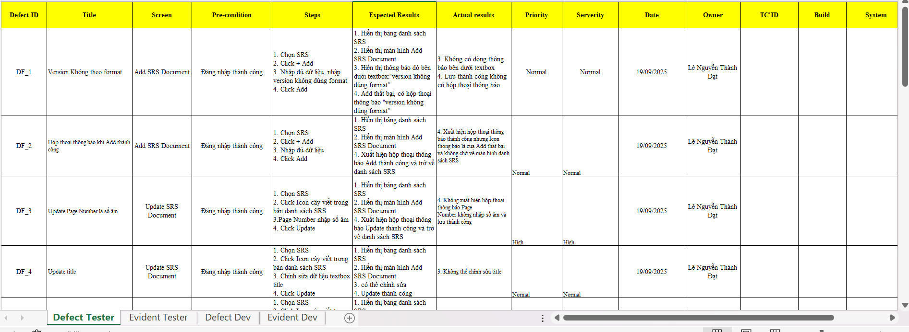
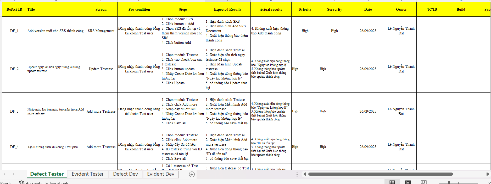

# PhanMem_QLTestCase_PST  
Viết TestCase, DefectList cho phần mềm quản lý test case  

# Test Case Management System Testing  

## 📌 Description  
This repository contains testing artifacts for the Test Case Management System (PST).

## 🧪 Scope  
- Understand requirements  
- Test Case Design  
- Defect Management  
- Retest  
- Test Report  

## 📂 Documents  
- Tìm Hiểu Yêu Cầu: /LeNguyenThanhDat_TiemHieuYeuCau_ver1.0.xlsx
  

- Test Cases: /testcase_PST_ver1.0.xlsx
  

- Defect List (Dev & Tester): /LeNguyenThanhDat_Defectlist_Dev&Tester_PST_Ver1.0.xlsx  
  

- Defect List (Retest): /LeNguyenThanhDat_DefectList_PST_retest.xlsx
  

- Test Report: /TestReport.docx  

## 📊 Summary  

| STT | Module | Test Case | PASS | FAIL | BLOCKED |
|-----|--------|----------|------|------|---------|
| 1 | SRS Management | 100 | 71 | 3 | 26 |
| 2 | Test Plan Management | 100 | 73 | 3 | 24 |
| 3 | Test Case Management | 100 | 74 | 0 | 26 |
| 4 | Defect Management | 100 | 72 | 0 | 28 |
| **Total** |  | **400** | **290** | **6** | **104** |

### Defect Summary  
- Total defects: **24**  
- After retest: **100% fixed**  
- New defects during retest: **10**  

## 🛠 Tools  
- Excel  
- Manual Testing  
